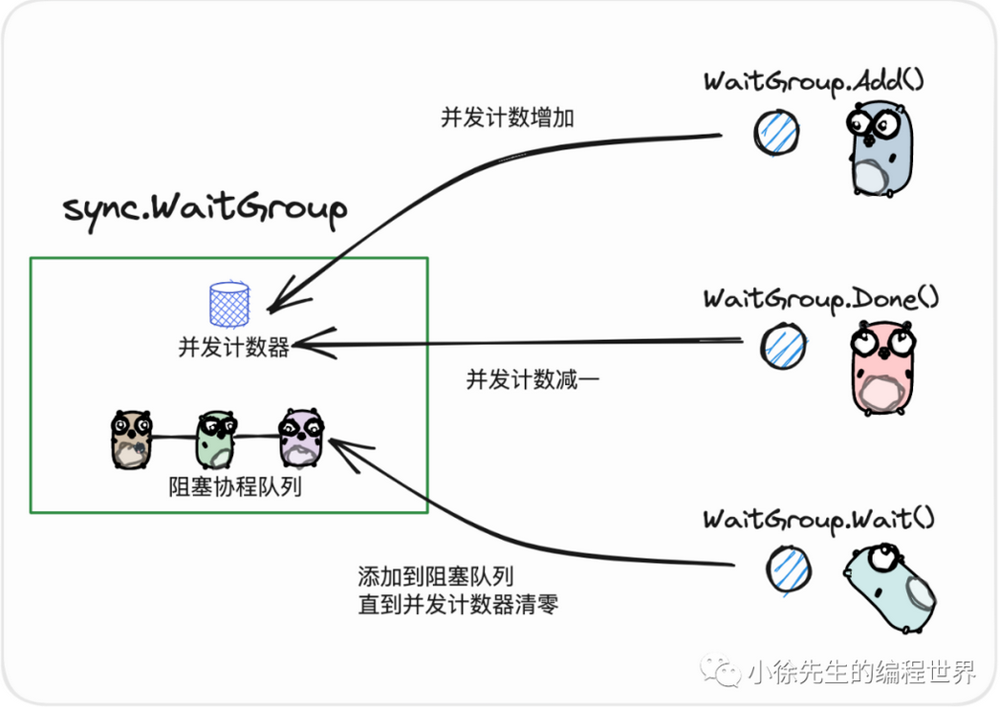
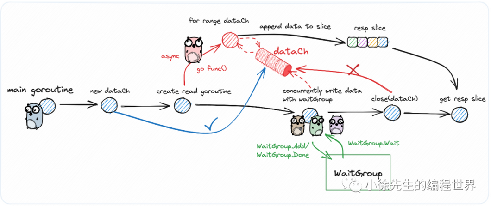
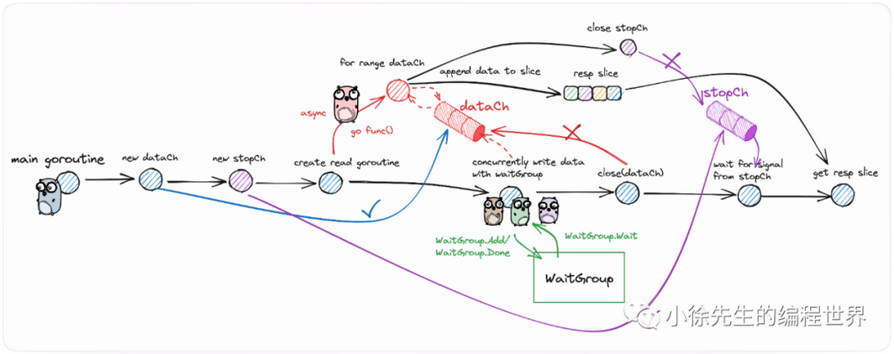
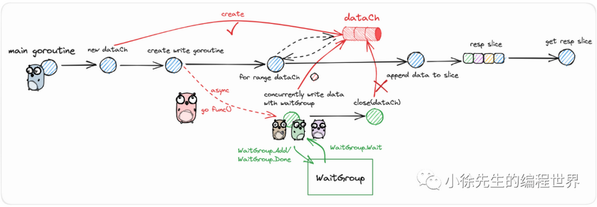
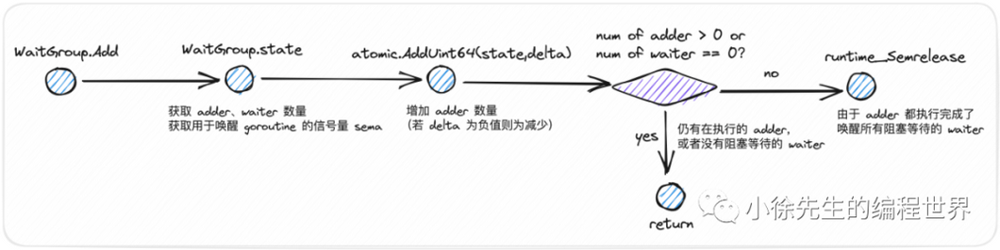
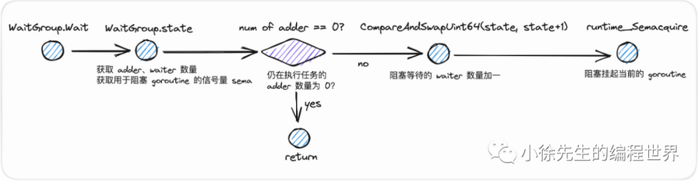

# Waitgroup and Async

## Advantage of waitgroup
- When the program finishes a register, the waitgroup should add 1. WaitGroup.add(n) means to launch N goroutine
- When the program finishes a report, the waitgroup should minus 1. WaitGroup.Done and one goroutine exits
- Waitgroup.wait aims to wait all goroutines finish. During waiting, the main goroutine is congest until all goroutine finish

![async](img/Screenshot 2023-11-02 at 09.32.15.png

## Waitgroup and Channel in order to aggregate all data

### Version 1

### Version 2

### Version 3

## Explanation

### WaitGroup.add

### WaitGroup.wait

